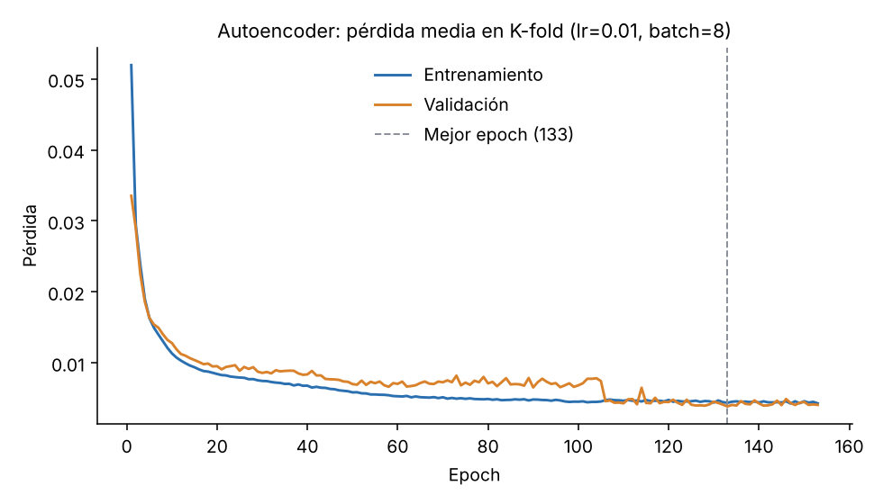
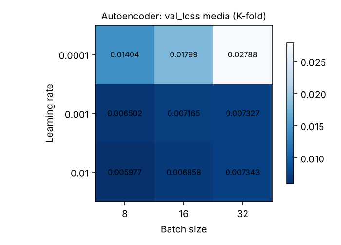
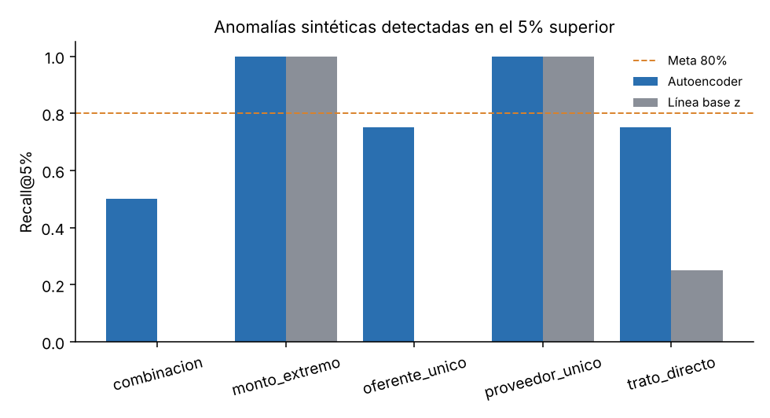
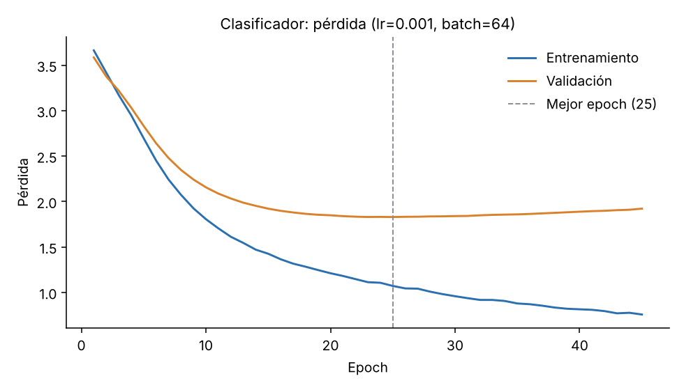
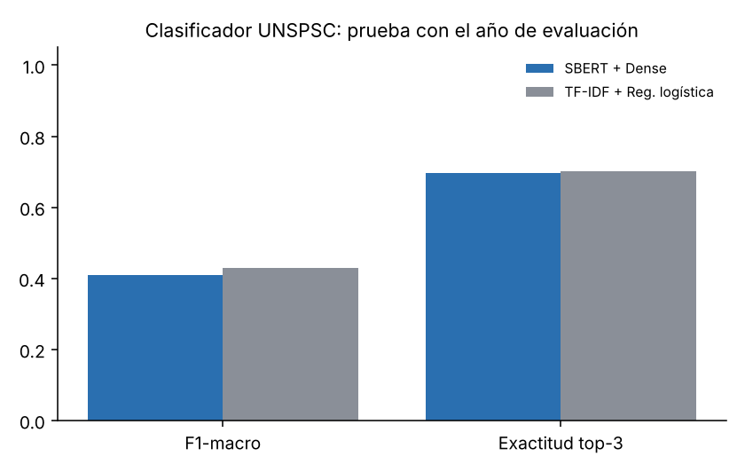

# Reporte de evaluación — ObservaCompras IA

> **Modo demostración.** Resultados con el primer semestre de 2023: el periodo ene–mar cumple el rol de 2023 (entrenamiento) y abr–jun el de 2024 (prueba). Los resultados definitivos se obtienen al ejecutar el pipeline con 2023 y 2024 completos.

> **Atención:** Resultados con codificador de PRUEBA (TF-IDF+SVD), no con Sentence-BERT. No válidos para H2.

## Datos

- Órdenes de compra procesadas: 365.251 (por periodo: 2023: 176.425; 2024: 188.826)
- Licitaciones adjudicadas: 11.450 (por periodo: 2023: 5.095; 2024: 6.355)
- Organismos: 224; organismos-año con perfil: 224 (entrenamiento) y 224 (evaluación)
- Órdenes de compra a proveedores persona natural (anonimizados): 32.970

## Tabla 4: métricas, líneas base y metas

| Métrica | Resultado | Línea base | Meta | ¿Cumple? | Hip. |
|---|---|---|---|---|---|
| Recall@5% de anomalías sintéticas | 80% | 45% (regla z) | ≥ 80% | ✅ Sí | H1 |
| Estabilidad del ranking (top 10, media entre pares de folds) | 5.4 de 10 | — | ≥ 7 de 10 | ❌ No | H1 |
| F1-macro del clasificador | 0.408 | 0.429 (TF-IDF + reg. logística) | Línea base + 5 puntos | ❌ No (-2.1 pts) | H2 |
| Exactitud top-3 | 70% | 70% | ≥ 90% | ❌ No | H2 |
| Explicabilidad (top 10) | pendiente | — | ≥ 7 de 10 | pendiente | H3 |
| Tiempo de tarea y SUS | pendiente | Revisión manual en planilla | Mediana < 5 min y SUS ≥ 70 | pendiente | H4 |

## H1 — Detector de patrones atípicos (autoencoder)

- Hiperparámetros elegidos por K-fold (K = 5): learning rate 0.01, batch size 8, 133 epochs en el modelo final (val_loss media 0.00598).
- Estabilidad: coincidencia media del top 10 entre pares de folds 5.4, mínima 4; organismos presentes en el top 10 de los 5 folds: 3.
- Coincidencia entre el top 10 del autoencoder y el de la regla z: 3 de 10.

Recall@5% por tipo de anomalía sintética:

| Tipo | Autoencoder | Regla z |
|---|---|---|
| combinacion | 50% | 0% |
| monto_extremo | 100% | 100% |
| oferente_unico | 75% | 0% |
| proveedor_unico | 100% | 100% |
| trato_directo | 75% | 25% |

## H2 — Clasificador UNSPSC (transfer learning)

- 42 familias UNSPSC (4 dígitos) con ≥ 30 ejemplos.
- Entrenamiento 3379, validación 596, prueba 4868 (se excluyeron 1487 licitaciones de prueba de familias no vistas).
- Hiperparámetros elegidos: learning rate 0.001, batch size 64, mejor epoch 25.
- Exactitud top-1: 43% (transfer learning) vs. 45% (línea base).

## H3 — Explicabilidad

Los autores revisan los 10 organismos más atípicos en `reports/revision_explicabilidad_H3.csv` (columna `descriptible_en_una_frase`).

| # | Organismo | Explicación generada |
|---|---|---|
| 1 | CENTRAL DE ABASTECIMIENTO DEL SISTEMA NACIONAL DE SERVICIO DE SALUD | Este organismo se aparta del patrón típico principalmente por su monto total adjudicado (sobre lo esperado) y por el monto medio de sus compras (sobre lo esperado). |
| 2 | SERVICIO DE SALUD MAGALLANES | Este organismo se aparta del patrón típico principalmente por la cantidad de rubros que compra (sobre lo esperado) y por el monto medio de sus compras (bajo lo esperado). |
| 3 | SERVICIO DE SALUD DE ARICA Y PARINACOTA | Este organismo se aparta del patrón típico principalmente por la cantidad de rubros que compra (sobre lo esperado) y por el monto medio de sus compras (bajo lo esperado). |
| 4 | SUPERINTENDENCIA DE SALUD | Este organismo se aparta del patrón típico principalmente por la cantidad de rubros que compra (bajo lo esperado) y por su porcentaje de trato directo (sobre lo esperado). |
| 5 | SERVICIO NACIONAL DE SALUD HOSPITAL DE COCHRANE | Este organismo se aparta del patrón típico principalmente por el monto medio de sus compras (bajo lo esperado) y por su monto total adjudicado (bajo lo esperado). |
| 6 | SERVICIO DE SALUD DEL MAULE HOSPITAL DE MOLINA | Este organismo se aparta del patrón típico principalmente por el monto medio de sus compras (bajo lo esperado) y por su porcentaje de proveedores nuevos (sobre lo esperado). |
| 7 | SERVICIO NACIONAL DE SALUD HOSPITAL DE C | Este organismo se aparta del patrón típico principalmente por su monto total adjudicado (bajo lo esperado) y por el monto medio de sus compras (bajo lo esperado). |
| 8 | SERVICIO NACIONAL DE SALUD HOSPITAL DE RIO NEGRO | Este organismo se aparta del patrón típico principalmente por el monto medio de sus compras (bajo lo esperado) y por su monto total adjudicado (bajo lo esperado). |
| 9 | SERVICIO NACIONAL DE SALUD HOSPITAL DE LEBU | Este organismo se aparta del patrón típico principalmente por su porcentaje de proveedores nuevos (sobre lo esperado) y por su porcentaje de trato directo (bajo lo esperado). |
| 10 | DIRECCION SALUD RURAL | Este organismo se aparta del patrón típico principalmente por el monto medio de sus compras (bajo lo esperado) y por su monto total adjudicado (bajo lo esperado). |

## H4 — Utilidad

Protocolo en `docs/guia_pruebas_usuario.md`; resultados en `reports/pruebas_usuario_H4.csv`.

## Revisión manual de etiquetas (Tabla 5)

Muestra de 100 licitaciones de prueba en `reports/muestra_revision_manual.csv`.

_Un patrón atípico no es evidencia de irregularidad; indica dónde conviene mirar._
